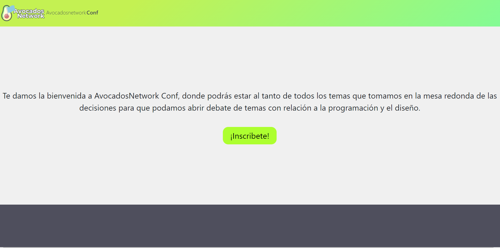
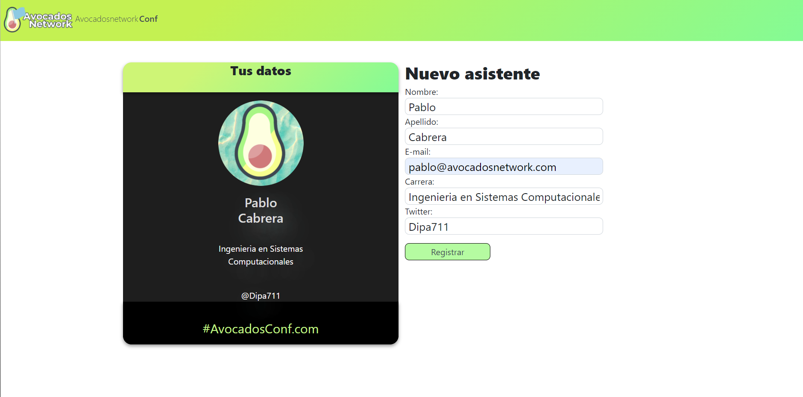
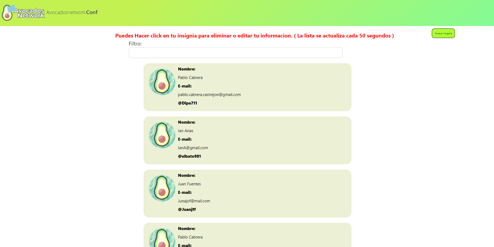
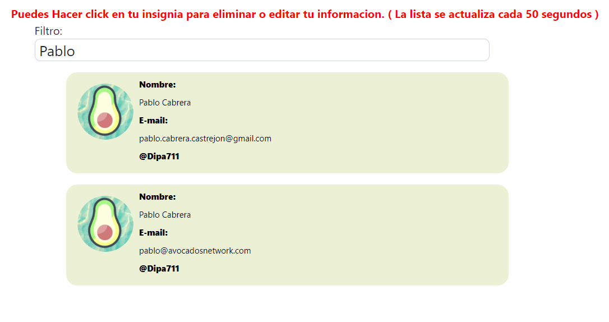

<h1>Avocados Network Conf</h1>

<h4>This is an aplication made whit react were you can create, edit and delete badges of the users.</h4>
<h5>You create a Badge:</h5>

<h5>then you can see the list of the created badges:</h5>

<h5>hear you can search your badge, if you click on it it will letyou delete your badge or create a new one.</h5>

<h5>Thanks for visiting my application, made with love by Dipa71.</h5>